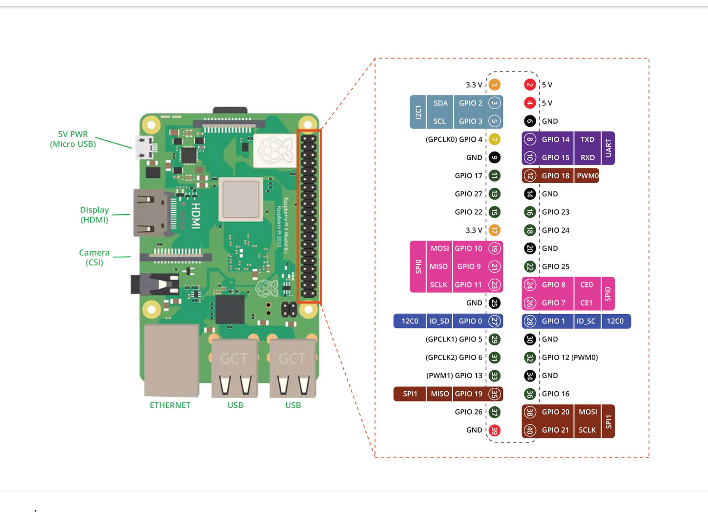

# RGB Status LED (WS2812B) + OLED Display (SSD1306) for Raspberry Pi 4

**English** · [Deutsch](doc/de/README.md)

A status LED (WS2812B) plus a 128×32 OLED (SSD1306 / Adafruit PiOLED) on a Raspberry Pi 4. The LED shows the system state by colour, the OLED shows the same state in plain text (IP, CPU, RAM, status). Both are driven by a single script (`status_led.py`) and one service. The last section is a hands-on **Troubleshooting** chapter with the pitfalls from a real-world setup.

## What the LED shows

- **LED green** — normal operation; bright flicker on disk activity
- **LED red/green alternating every second** — over-temperature (threshold configurable)
- **LED blue blinking** — no network connection
- **LED magenta blinking** — backup failed
- **LED cyan pulsing** — backup running
- **OLED** — continuously shows IP address, CPU temperature + load, RAM usage and the state in plain text

---

## 1. Requirements

### Hardware

- Raspberry Pi 4 with Raspberry Pi OS (Bookworm) — **with a physical GPIO header**
- WS2812B LED (5050), single or as a strip
- OLED display 128×32, SSD1306, I2C (e.g. Adafruit PiOLED)
- Resistor 330–470 Ω for the LED data line
- Jumper wires; for multiple LEDs also a level shifter (74AHCT125) and a 1000 µF capacitor

### Software

- Python 3 (pre-installed on Raspberry Pi OS)
- Internet access for the one-time library installation
- The file `status_led.py` (from this repository)

---

## 2. LED connection method: PWM or SPI

The WS2812B can be driven two ways. The OLED is unaffected (separate bus).

- **PWM (GPIO18) — recommended**, especially for a single LED. The data line is driven cleanly and pulled Low when idle — "off" stays off and weak colours (dim green) stay stable. Requirement: the service runs as **root** and the onboard audio must be disabled.
- **SPI (GPIO10/MOSI)** — runs without root and without the audio conflict. **However:** the Pi leaves the SPI data line High between packets; some WS2812B read this as "all bits on" = white. Dim colours and "off" can then drift to white (see Troubleshooting). Only use this if root/audio are a problem and the LED passes the test.

> **Tip:** When in doubt, use PWM — it is the robust default for a single WS2812B on the Pi. This guide is written for PWM; the SPI steps are noted as an alternative throughout.

---

## 3. Wiring (LED + OLED)

Power off the Pi and connect both. The pins of the two devices do not overlap:

### WS2812B (LED)

- **DIN** (mind the arrow — input side) → through the **330–470 Ω resistor** to **GPIO18 / pin 12** (PWM) or GPIO10/MOSI (SPI)
- **VDD** → for a **single** LED to **3.3 V (pin 1)**; for multiple LEDs to 5 V *with* a level shifter
- **GND** → GND of the Pi (a common ground is mandatory)

> **Tip:** VDD at 3.3 V instead of 5 V is the simplest and clean permanent solution for a single LED: the Pi outputs data at 3.3 V, but a WS2812B at 5 V expects ~3.5 V for "High" — at 3.3 V VDD the level matches again. For multiple LEDs (5 V required) a level shifter (74AHCT125) is needed.

### OLED (SSD1306, I2C)

- **3V3** → pin 1  ·  **GND** → GND
- **SDA** → GPIO2 (pin 3)  ·  **SCL** → GPIO3 (pin 5)

### Push button (display + reboot)

- One leg → **GPIO17 (pin 11)**, the other leg → **GND** (e.g. pin 14)
- The internal pull-up is enabled in software (pressed = LOW), so **no resistor is needed**
- Short press cycles the display pages, a long press (≥ 5 s) reboots the Pi (see section 11)

### Combined pin overview

| Device / function         | Pin          | Signal         |
|---------------------------|--------------|----------------|
| LED – data (PWM, rec.)    | Pin 12       | GPIO18         |
| LED – data (SPI, alt.)    | Pin 19       | GPIO10 / MOSI  |
| LED – VDD (1 LED)         | Pin 1        | 3V3            |
| LED – GND                 | Pin 9 (free) | GND            |
| OLED – 3V3                | Pin 1        | 3V3            |
| OLED – SDA                | Pin 3        | GPIO2          |
| OLED – SCL                | Pin 5        | GPIO3          |
| OLED – GND                | Pin 6        | GND            |
| Button – signal           | Pin 11       | GPIO17         |
| Button – GND              | Pin 14 (free)| GND            |

*Pin 1 (3V3) powers both the OLED and the single LED — both may share it. A PiOLED usually sits on the corner pins (1/3/5 + GND), so take the LED's GND from a free pin (e.g. pin 9).*

### Raspberry Pi 4 – pinout (reference)



*Assignment for this project: **LED data** to GPIO18 (pin 12), **LED VDD** and **OLED 3V3** to 3.3 V (pin 1), **OLED SDA** to GPIO2 (pin 3), **OLED SCL** to GPIO3 (pin 5), **push button** on GPIO17 (pin 11) against GND, common **ground** to a GND pin (e.g. pin 6, 9 or 14). SPI alternative for the LED data: GPIO10/MOSI (pin 19).*

---

## 4. Do OLED and LED work together?

**Yes.** The OLED is on the **I2C bus** (GPIO2/3), the LED on the **PWM line** (GPIO18) or the **SPI bus** (GPIO10). Separate hardware buses on different pins — no conflict. Both are driven by the same process (`status_led.py` refreshes the OLED once per second). If the OLED fails to initialise, the LED still runs, and vice versa.

**Requirement:** real GPIO/I2C/SPI interfaces of a Raspberry Pi. In an LXC container or a VM (e.g. on an x86 Proxmox host) there is no Pi header — then none of this works. Quick check whether it is a real Pi with both buses:

```bash
cat /proc/device-tree/model        # must show 'Raspberry Pi 4 ...'
ls -l /dev/i2c-1 /dev/spidev0.0    # both device files must exist
```

---

## 5. Install the script

Copy the file into a fixed location and make it executable:

```bash
sudo cp status_led.py /usr/local/bin/status_led.py
sudo chmod +x /usr/local/bin/status_led.py
```

---

## 6. Install the libraries

Each command is deliberately on **one line** — a backslash at the end of a line is not needed (and, in the middle of a line, causes errors).

### PWM (recommended)

```bash
sudo apt install -y python3-pil i2c-tools
sudo pip3 install adafruit-blinka --break-system-packages
sudo pip3 install rpi_ws281x --break-system-packages
sudo pip3 install adafruit-circuitpython-neopixel --break-system-packages
sudo pip3 install adafruit-circuitpython-ssd1306 --break-system-packages
```

### SPI (alternative)

```bash
sudo apt install -y python3-pil i2c-tools
sudo pip3 install adafruit-blinka --break-system-packages
sudo pip3 install adafruit-circuitpython-neopixel-spi --break-system-packages
sudo pip3 install adafruit-circuitpython-ssd1306 --break-system-packages
```

### Alternative — virtual environment (without touching the system Python)

```bash
sudo apt install -y python3-venv i2c-tools
sudo python3 -m venv /opt/status-led-venv
sudo /opt/status-led-venv/bin/pip install adafruit-blinka rpi_ws281x
sudo /opt/status-led-venv/bin/pip install adafruit-circuitpython-neopixel
sudo /opt/status-led-venv/bin/pip install adafruit-circuitpython-ssd1306 pillow
```

> **Note:** With the venv variant, use the interpreter from the venv in the service (section 10):
> `ExecStart=/opt/status-led-venv/bin/python /usr/local/bin/status_led.py`

---

## 7. Enable I2C, check the OLED, (PWM:) disable audio

Enable I2C for the OLED (for the SPI LED also enable SPI):

```bash
sudo raspi-config
#  Interface Options  ->  I2C   ->  Yes
#  (SPI variant only:  Interface Options -> SPI -> Yes)
```

For the **PWM variant** the onboard audio must be off (it shares the PWM hardware, otherwise the LED flickers). In `/boot/firmware/config.txt`:

```bash
sudo sed -i 's/^dtparam=audio=on/dtparam=audio=off/' /boot/firmware/config.txt
grep audio /boot/firmware/config.txt
#  if grep shows no 'audio=off', then once:
echo "dtparam=audio=off" | sudo tee -a /boot/firmware/config.txt
```

After the interface changes, reboot and look for the OLED on the I2C bus:

```bash
sudo reboot
#  after the reboot:
sudo i2cdetect -y 1
```

> **Note:** If `3c` appears in the table, the display is detected. If yours shows `0x3d`, enter that value in the config at `oled_addr`.

---

## 8. Adjust the configuration

Open the configuration block at the top of `status_led.py` (excerpt):

```python
sudo nano /usr/local/bin/status_led.py

@dataclass
class Config:
    led_type: str = "ws2812"        # PWM (recommended); SPI: "ws2812-spi"
    ws_count: int = 1               # the actual number of LEDs!
    ws_brightness: float = 0.50     # master brightness 0..1
    ws_pixel_order: str = "GRB"     # standard WS2812B; rarely "RGB"
    oled_enabled: bool = True       # drive the OLED in parallel
    oled_addr: int = 0x3C           # I2C address (see i2cdetect)
    temp_threshold_c: float = 70.0  # over-temperature threshold in degrees C
    net_check_host: str = "1.1.1.1" # internet check; for LAN use the gateway IP
    button_enabled: bool = True     # push button on GPIO17
    button_pin: int = 17            # BCM pin, button to GND (internal pull-up)
    button_long_press_s: float = 5.0  # hold this long -> reboot
    oled_page_timeout_s: float = 30.0 # auto-return to the overview (page 0)
```

- **`led_type`** — `"ws2812"` (PWM) or `"ws2812-spi"` (SPI)
- **`ws_count`** — **exactly** the number of your LEDs; too low → surplus LEDs keep their old value
- **`ws_pixel_order`** — almost always `"GRB"`; only change it if the colour test says so
- **`ws_brightness`** — master dimmer; WS2812B are very bright, 0.2–0.5 is usually pleasant
- **`button_pin`** — BCM pin of the push button (default GPIO17 / pin 11)
- **`button_long_press_s`** — hold time that triggers a reboot (default 5 s)
- **`oled_page_timeout_s`** — after this idle time the display returns to the overview

---

## 9. Functional test

### Without hardware (terminal)

Shows the LED states and the OLED lines in parallel in the terminal:

```bash
python3 status_led.py --simulate --duration 30
```

### Direct LED test (colours + stability, PWM)

Checks the colour order and whether dim green stays stable (with sudo, GPIO18):

```bash
sudo systemctl stop status-led.service
sudo python3 - <<'PYEOF'
import board, neopixel, time
px = neopixel.NeoPixel(board.D18, 1, brightness=0.3, auto_write=True, pixel_order="GRB")
for n,c in [("RED",(255,0,0)),("GREEN",(0,255,0)),("BLUE",(0,0,255))]:
    px.fill(c); print("commanded:", n); time.sleep(2)
print("20s dim green - stays green, then off cleanly?")
for i in range(200): px.fill((0,40,0)); time.sleep(0.1)
px.fill((0,0,0))
PYEOF
```

> **Note:** Red/green/blue must match, the dim green must stay stable and turn off cleanly at the end. For the SPI variant use `neopixel_spi.NeoPixel_SPI(board.SPI(), 1, ...)` instead.

### Service in the foreground (shows errors live)

```bash
python3 /usr/local/bin/status_led.py    # stop with Ctrl+C
```

---

## 10. Autostart as a service (systemd)

One service drives the LED and the OLED together. Create the service file (template included in this repo):

```bash
sudo nano /etc/systemd/system/status-led.service
```

```ini
[Unit]
Description=RGB Status LED + OLED
After=network-online.target
Wants=network-online.target

[Service]
Type=simple
ExecStart=/usr/bin/python3 /usr/local/bin/status_led.py
Restart=always
RestartSec=5
User=root
RuntimeDirectory=status-led
#  SPI variant: User=YOUR_USERNAME  (NOT 'pi')
#  venv: ExecStart=/opt/status-led-venv/bin/python /usr/local/bin/status_led.py

[Install]
WantedBy=multi-user.target
```

> **Tip:** Important about the user: **PWM needs `User=root`**. For the SPI variant enter a real username — current Raspberry Pi OS no longer has the former default user `pi`. A wrong/missing user leads to `status=217/USER` (see Troubleshooting).

Enable, start and check:

```bash
sudo systemctl daemon-reload
sudo systemctl enable --now status-led.service
systemctl status status-led.service
journalctl -u status-led -f
```

> **Note:** For the SPI variant as a normal user, that user must be in the groups `spi` and `i2c` (default on Raspberry Pi OS): `groups YOUR_USER` and `sudo usermod -aG spi,i2c YOUR_USER`.

---

## 11. Cycle the display and reboot (push button)

A push button on **GPIO17 (pin 11)** controls the display and can reboot the Pi:

- **Short press** — advances the display by one page. Page 0 is the familiar 4-line overview; pages 1–4 each show one line (IP, CPU, RAM, status) on its own in a **large, auto-fitted font**. After the last page it wraps back to the overview.
- **Auto-return** — after about 30 seconds without a press the display jumps back to the overview (page 0). Configurable via `oled_page_timeout_s`.
- **Long press (≥ 5 s)** — reboots the Pi. The OLED shows “Neustart…”, the LED turns red, then `systemctl reboot` runs. The hold time is set by `button_long_press_s`.

The reboot needs root privileges — with the recommended PWM setup the service already runs as `User=root`, so it works out of the box. For the SPI variant under a normal user you would need a sudoers/polkit rule. The button uses Blinka’s `digitalio` and needs no extra package. Disable it with `--no-button` or `button_enabled = False`.

---

## 12. Connect a backup status (optional)

The script reads the backup state from `/run/status-led/backup`. If the file is missing, no backup state is shown. Your backup job writes `running`, `ok` or `failed` into it:

```bash
#!/bin/bash
mkdir -p /run/status-led
echo running > /run/status-led/backup

if restic backup /data; then
    echo ok > /run/status-led/backup
else
    echo failed > /run/status-led/backup
fi
```

> **Note:** The failure state (LED magenta, OLED "Backup-Fehler!") stays until the file is set back to `ok`.

---

## 13. Reference: states, LED colour and OLED text

| State                 | LED colour & pattern  | OLED text         | Prio |
|-----------------------|-----------------------|-------------------|------|
| Over-temperature      | Red/green, 1 Hz       | UEBERTEMPERATUR!  | 100  |
| No network            | Blue, 2 Hz blinking   | Kein Netzwerk     | 80   |
| Backup failed         | Magenta, 2 Hz         | Backup-Fehler!    | 70   |
| Backup running        | Cyan, pulsing         | Backup laeuft...  | 40   |
| Normal operation      | Green (bright on I/O) | Normalbetrieb     | 0    |

When several states are active, the one with the highest priority wins (for both LED colour and OLED text). The OLED also permanently shows IP, CPU temperature + 1-minute load and RAM.

> **Note:** The OLED texts are defined in `STATUS_TEXT` in `status_led.py` (German by default). Edit them there to localise the display.

---

## 14. Add your own states

Each state consists of a condition and a render function and is registered with a priority in the `STATUSES` list. For the OLED display, also add a text in `STATUS_TEXT`:

```python
def is_my_state(ctx):
    return ...                  # True when active

def render_my_state(ctx):
    return (1.0, 0.5, 0.0)      # colour (R, G, B), each 0..1

STATUSES.append(StatusDef("my_state", priority=50,
                          condition=is_my_state,
                          render=render_my_state))
STATUS_TEXT["my_state"] = "My text"
```

---

## 15. Troubleshooting (from practice)

The following cases come from a real setup — from the service start to the flickering LED.

### ▶ Service does not start, status "status=217/USER" in the log
- **Cause:** The user given in the `.service` file does not exist. Current Raspberry Pi OS no longer has the former default user `pi`.
- **Fix:** For PWM set `User=root`; for SPI use the real username. Then `daemon-reload` and `restart`.

### ▶ pip error "externally-managed-environment"
- **Cause:** On Bookworm the system Python is protected (PEP 668) — or a backslash sits in the middle of the line instead of at the end and breaks the command.
- **Fix:** Put each command on **one** line and add `--break-system-packages` at the end, or use the venv variant (section 6).

### ▶ LED does not light at all, although the script runs without errors
- **Cause:** Wiring (DIN/DOUT swapped, no common ground) or a logic level that is too low (VDD at 5 V, data only 3.3 V).
- **Fix:** First check full brightness with the direct test (section 9). If nothing lights: check the DIN side and GND, then move VDD from 5 V to **3.3 V** as a test. For a single LED, 3.3 V is the permanent solution.

### ▶ Wrong colours (e.g. red commanded, green lights up)
- **Cause:** The colour-channel order of the LED differs. The standard is `GRB`; some batches differ.
- **Fix:** Use the colour test (section 9) to find which order makes "red" actually red, and enter that value in `ws_pixel_order`. GRB is correct most of the time.

### ▶ LED drifts to white when idle, "off" does not stay off (with SPI)
- **Cause:** The Pi leaves the SPI data line (MOSI) High between packets. The WS2812B reads this as all ones = white. Bright colours survive it, dim green and "off" flip.
- **Fix:** Switch to the **PWM method (GPIO18)** — it pulls the line cleanly to Low. Move the data line to pin 12, set `led_type="ws2812"`, disable audio, run the service as root (sections 6–10).

### ▶ Only one of several LEDs shows the status, the rest stay (white)
- **Cause:** `ws_count` is too low — surplus LEDs keep their last value.
- **Fix:** Set `ws_count` to the actual number of LEDs and restart the service.

### ▶ PWM: LED flickers or shows wrong colours despite correct wiring
- **Cause:** The onboard audio is still active and occupies the PWM hardware.
- **Fix:** Enter `dtparam=audio=off` in `/boot/firmware/config.txt` and reboot (section 7).

### ▶ OLED stays dark
- **Cause:** I2C not enabled, wrong address, PIL missing or wiring.
- **Fix:** `sudo i2cdetect -y 1` — does `0x3c` appear? Otherwise enable I2C, install `python3-pil`/pillow, check SDA/SCL/3V3/GND; if needed put `0x3d` in `oled_addr`.

### ▶ Neither LED nor OLED respond; /dev/i2c-1 or /dev/spidev0.0 are missing
- **Cause:** Not a real Raspberry Pi (e.g. LXC container/VM on x86) or the bus is not enabled.
- **Fix:** `cat /proc/device-tree/model` must show a Pi. In an LXC/VM without a passed-through GPIO/I2C/SPI interface there are no pins — then run it on real Pi hardware.

### ▶ After a system update the LED suddenly flickers again (PWM)
- **Cause:** An update reset `/boot/firmware/config.txt`; `dtparam=audio=off` is missing again.
- **Fix:** Add the line again and reboot.

### ▶ Button does nothing
- **Cause:** Wrong pin, the button is not wired against GND, or it is disabled.
- **Fix:** Wire the button between **GPIO17 (pin 11)** and GND, check `button_pin` and `button_enabled = True`. The internal pull-up means pressed = LOW; no resistor needed.

### ▶ Long press does not reboot
- **Cause:** The service does not run as root (e.g. the SPI variant under a normal user).
- **Fix:** Run the service as `User=root` (the PWM default), or add a sudoers/polkit rule allowing `systemctl reboot`.

### ▶ The large single-line pages show tiny text
- **Cause:** No scalable TrueType font was found, so the small bitmap font is used.
- **Fix:** Install the DejaVu fonts: `sudo apt install -y fonts-dejavu-core`.

### Useful diagnostic commands

```bash
cat /proc/device-tree/model            # real Pi?
ls -l /dev/i2c-1 /dev/spidev0.0        # buses present?
sudo i2cdetect -y 1                    # OLED at 0x3c?
groups YOUR_USER                       # in groups spi/i2c?
python3 /usr/local/bin/status_led.py   # (stop the service) errors in the foreground
journalctl -u status-led -e            # service log with errors
```

---

*Tested, working configuration: `led_type = "ws2812"` (PWM, GPIO18), `ws_pixel_order = "GRB"`, `ws_count = 1`, service as `User=root`, onboard audio disabled, LED VDD at 3.3 V.*
